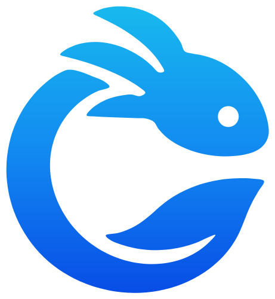

	<a href="https://pmmp.io">
		<!--[if IE]>
			
		<![endif]-->
		<picture>
			<source srcset="./.github/readme/axolotl-logo.svg" media="(prefers-color-scheme: dark)">
			
		</picture>
	</a> 
	<b>A highly customisable, open source server software for Minecraft: Bedrock Edition written in PHP</b>

	
	
	
	 
	
	

## What is this?
Axolotl-PM is a highly customisable server software for Minecraft: Bedrock Edition, built from scratch in PHP, with over 10 years of history.

If you're looking to create a Minecraft: Bedrock server with **custom functionality**, look no further.

- 🧩 **Powerful plugin API** - extend and customise gameplay as you see fit
- 🗺️ **Rich ecosystem** and **large developer community** - find plugins easily and learn to develop your own
- 🌐 **Multi-world support** - offer a more varied game experience to players without transferring them to other server nodes
- 🏎️ **Performance** - get 100+ players onto one server (depending on hardware and plugins)
- ⤴️ **Continuously updated** - new Minecraft versions are usually supported within days

## Getting Started
- [Documentation](http://pmmp.readthedocs.org/)
- [Installation instructions](https://pmmp.readthedocs.io/en/rtfd/installation.html)
- [Docker image](https://github.com/axolotl-pm/PocketMine-MP/pkgs/container/pocketmine-mp)
- [Plugin repository](https://poggit.pmmp.io/plugins)

## Community & Support
Join our [Discord](https://discord.gg/3YspWxgJAm) server to chat with other users and developers.

## Developing Plugins
If you want to write your own plugins, the following resources may be useful.
Don't forget you can always ask our community if you need help.

 * [Developer documentation](https://devdoc.pmmp.io) - General documentation for PocketMine-MP plugin developers
 * [Latest release API documentation](https://apidoc.pmmp.io) - Doxygen API documentation generated for each release
 * [Latest bleeding-edge API documentation](https://apidoc-dev.pmmp.io) - Doxygen API documentation generated weekly from `major-next` branch
 * [DevTools](https://github.com/pmmp/DevTools/) - Development tools plugin for creating plugins
 * [ExamplePlugin](https://github.com/pmmp/ExamplePlugin/) - Example plugin demonstrating some basic API features

## Contributing to Axolotl-PM
Axolotl-PM accepts community contributions! The following resources will be useful if you want to contribute to PocketMine-MP.
 * [Building and running PocketMine-MP from source](BUILDING.md)
 * [Contributing Guidelines](CONTRIBUTING.md)

New here? Check out [issues with the "Easy task" label](https://github.com/axolotl-pm/PocketMine-MP/issues?q=is%3Aissue%20state%3Aopen%20label%3A%22Easy%20task%22) for things you could work to familiarise yourself with the codebase.

## Licensing information
This project is licensed under LGPL-3.0. Please see the [LICENSE](/LICENSE) file for details.

Axolotl-PM are not affiliated with Mojang. All brands and trademarks belong to their respective owners. PocketMine-MP is not a Mojang-approved software, nor is it associated with Mojang.
